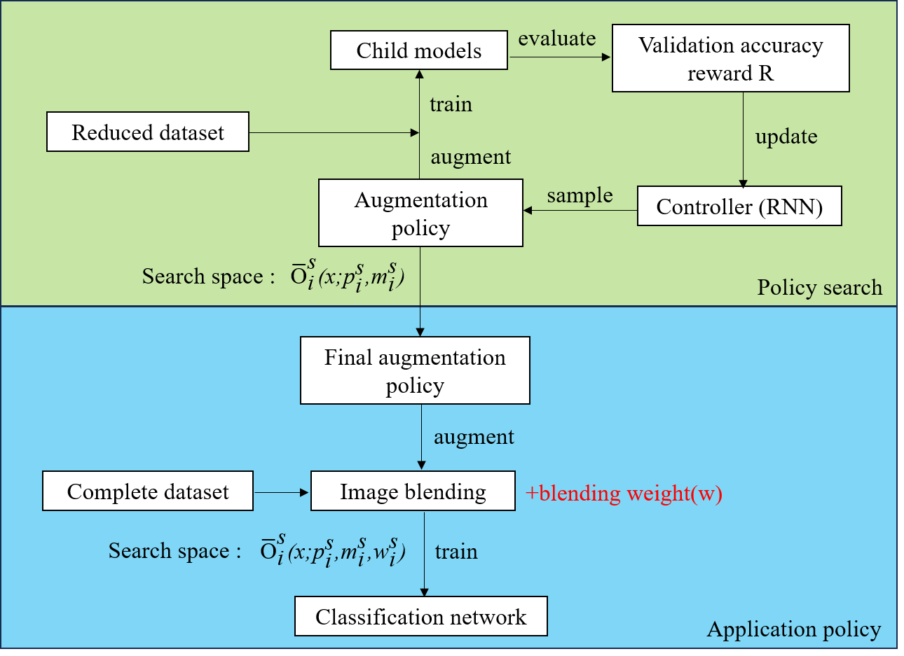
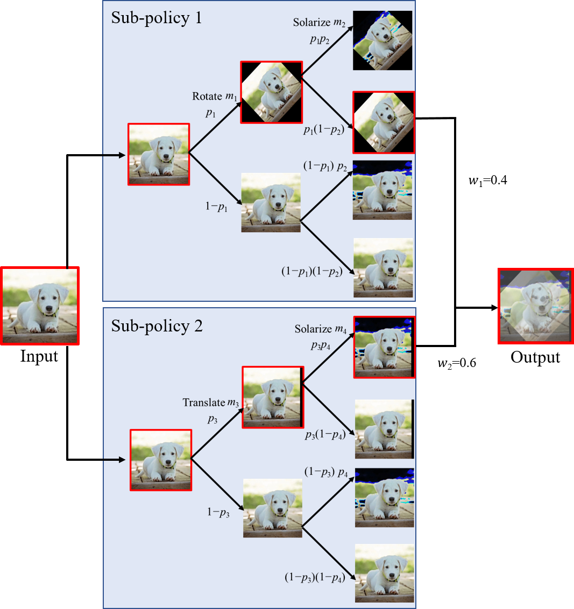

# Blend AutoAugment(BAA)





## ABSTRACT

Data augmentation improves machine learning model performance by diversifying training data. 
Formerly, manual selection of augmentation techniques was required, but AutoAugment automated 
this process. However, recent studies identified limits in the search space of AutoAugment, 
which hinder performance gains. In this study, to enhance the performance of image classification 
in deep learning, we introduced a novel method called Blend AutoAugment that utilizes linear blending 
with random weights. Our method consists of two stages: 1) policy search and 2) image blending. 
In the policy search stage, optimal policies are determined by employing reinforcement learning 
to explore a search space, which comprises the types of operations, their application probabilities, 
and magnitudes. In the image blending stage, multiple optimal policies discovered in the previous 
stage are selected to generate augmented images, and the generated images are blended using random
weights. Performance comparison experiments were conducted using the Wide-ResNet40-2 and Wide-ResNet28-10 
models on the CIFAR-10, CIFAR-100, CIFAR-10-C, and CIFAR-100-C datasets; and the proposed method 
was compared with existing methods. Notably, the proposed method exhibited a higher accuracy and 
robustness than those of existing methods. Furthermore, it was applicable to various existing 
automatic data augmentation methods. In summary, this study introduced an advanced automatic data
augmentation method that expands the previously limited search space and utilizes image blending
to achieve better accuracy and robustness than conventional methods.


## Contents
This project file generates augmented images for datasets such as CIFAR-10, CIFAR-100, 
SVHN through Blend AutoAugment(BAA). Additionally, within this project file,
training is conducted using learning models such as ResNet, Wide-ResNet, VGG. 
Following the training, tasks for evaluating image classification performance are 
included. By default, all processes are executed in `main.py`. The results of image 
classification are stored in CSV format within the `snapshots` folder in this project.

BAA utilizes policies discovered in AA (AutoAugment). In this source code, 
there is no separate policy exploration conducted. The code related to policy search 
can be downloaded from https://github.com/jfyao90/Auto-Augment-pytorch.


## Requirements

*   numpy>=1.22.4
*   torch==1.13.1
*   torchvision==0.14.1

## Setup

1.  Install PyTorch and other required python libraries with:

    ```
    pip install -r requirements.txt
    ```

2.  Download CIFAR-10-C and CIFAR-100-C datasets with:

    ```
    mkdir -p ./data/cifar
    curl -O https://zenodo.org/record/2535967/files/CIFAR-10-C.tar
    curl -O https://zenodo.org/record/3555552/files/CIFAR-100-C.tar
    tar -xvf CIFAR-100-C.tar -C data/cifar/
    tar -xvf CIFAR-10-C.tar -C data/cifar/
    ```

## Usage

After selecting the dataset and the type of training model to be used in `main.py`, 
execute the file.
Training recipes used in our paper:  `python main.py`

##Publication
Jonghoon Im, Jun Younes Louhi Kasahara, Hiroshi Maruyama, Hajime Asama and Atsushi Yamashita: "Blend AutoAugment: Automatic Data Augmentation for Image Classification Using Linear Blending", IEEE Access, Vol. 12, 2024. [doi:10.1109/ACCESS.2024.3401167]


